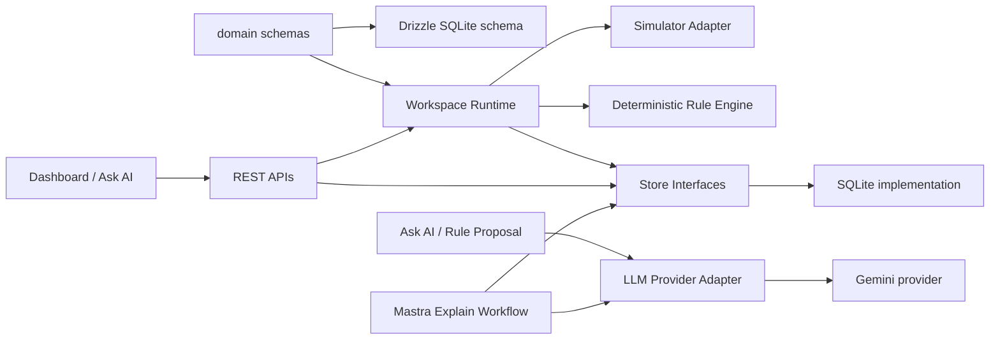
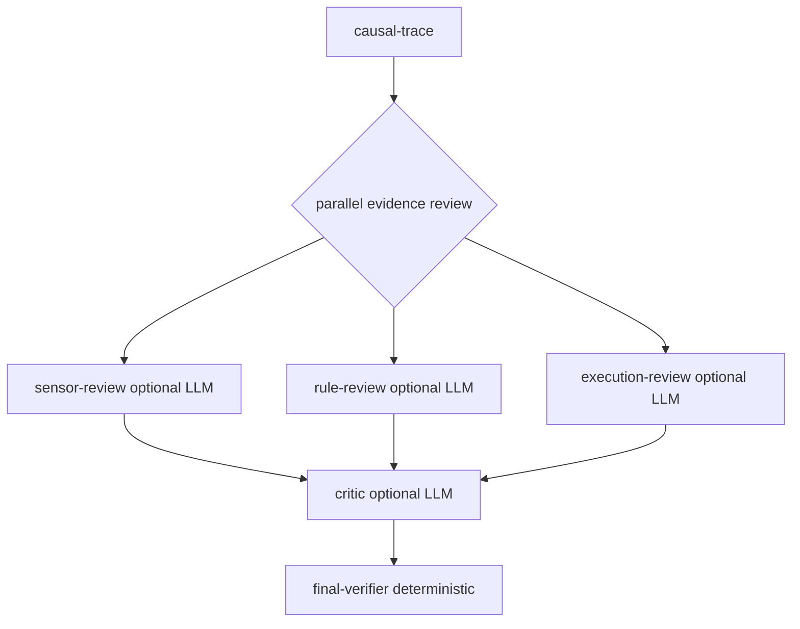

# Implementation Plan

## 1. Source Of Truth

The FDE-authored schemas in `domain/` are the source of truth.

All other layers are derived from, constrained by, or validated against those
domain schemas:

- database schema and seed data
- runtime validation and orchestration
- simulator and future hardware adapters
- REST API request and response contracts
- UI data contracts
- LLM tool declarations and structured outputs
- Mastra workflows and evidence reviews
- tests and evaluation fixtures

Implementation may add infrastructure boundaries, adapters, stores, workflows,
and UI views, but those layers must not invent domain concepts independently of
`domain/`.

## 2. Project Goal

Build a compact semantic physical workspace that makes the full path visible:

```text
FDE domain schema
    -> database schema
    -> runtime / adapter
    -> REST API
    -> UI
    -> LLM tools
    -> Mastra explanation workflow
```

The first version uses a simulator instead of real Arduino/MQTT hardware. Later,
an MQTT or hardware adapter should be able to replace the simulator without
changing the dashboard, rule engine, LLM tools, or Mastra workflow contracts.

## 3. Domain Contract

`domain/physical.ts` defines:

- sensor types and units
- device types and commands
- sensor reading shape
- device command shape
- device state, command result, connection status, simulator scenario, and
  workspace state

`domain/rule.ts` defines:

- supported condition operators
- rule condition and action shape
- rule input and patch validation
- persisted rule record shape

`domain/ontology.ts` defines:

- semantic classes
- semantic properties
- semantic individuals
- semantic relations
- ontology responses and UI selection contracts

These files should remain more stable than any database, LLM, deployment target,
or physical adapter.

## 4. Current Architecture



Core boundaries:

- LLMs must not access SQLite or hardware directly.
- LLMs must not execute device commands.
- Rule execution is deterministic and does not depend on the LLM.
- UI and AI access go through application APIs and store/service boundaries.
- All explainable actions must be grounded in auditable events.
- The event stream intentionally favors a simple demo architecture over
  sub-second realtime delivery: simulator readings are pushed into the runtime
  by callback and persisted immediately, while SSE clients receive events via
  server-side polling of the event store with cursor replay and heartbeats. A
  future runtime event bus could publish newly persisted events directly to SSE
  subscribers, but that extra subscriber lifecycle and multi-instance broadcast
  complexity is not needed for the current portfolio demo.

## 5. Completed Implementation

Implemented runtime and simulator:

- simulator adapter with four sensor types and four virtual device types
- workspace runtime for state, readings, device commands, scenarios, rules, and
  event persistence
- retention cleanup for high-volume sensor readings and events

Implemented semantic and operational APIs:

- ontology APIs
- class, property, individual, and relation APIs
- state, sensor, device, simulator, event, event stream, and rule APIs
- readiness and health endpoints

Implemented rule automation:

- deterministic rule evaluator
- rule validation against known sensors, devices, units, and commands
- rule CRUD and enable/disable flows
- event logging for rule matches and device command outcomes

Implemented LLM adapter:

- `lib/llm/provider.ts` defines provider-neutral LLM capabilities
- `lib/llm/gemini-provider.ts` adapts Gemini behind that interface
- app routes use `getLlmProvider()` instead of direct Gemini model/client calls
- provider-neutral tool declarations are used outside Gemini-specific code

Implemented DB/store boundary:

- `lib/stores/events-store.ts`
- `lib/stores/rules-store.ts`
- `lib/stores/ontology-store.ts`
- `lib/stores/physical-store.ts`
- `lib/stores/database-store.ts`
- `lib/stores/index.ts`

`getDb()` is intentionally contained in store implementations. App routes,
runtime modules, domain services, LLM code, and Mastra workflows should import
store factories from `@/lib/stores`, not individual SQLite details.

Implemented Explain Why:

- rule-triggered device commands include causation metadata
- deterministic causal trace builder reconstructs explainable action chains
- `/api/ai/explain-event` returns structured explanation data
- event timeline exposes Explain Why only for eligible action events
- Ask AI has an Explain Mode for causal trace, evidence, missing evidence,
  reviewer findings, and critic output

Implemented Mastra workflow:



- `@mastra/core` is installed
- `lib/explain-workflow.ts` runs a real Mastra workflow
- reviewer steps run in parallel
- reviewer and critic LLM calls are opt-in through `EXPLAIN_LLM_REVIEW=enabled`
- deterministic fallback remains the default path
- LLM reviewer and critic claims are constrained by available evidence IDs
- Ask AI renders the Mastra graph with `@xyflow/react`

## 6. Explain Why Rules

Explain Why answers:

```text
Why did this application action happen?
```

Eligible events:

- device command success/failure events
- rule-triggered device action events
- future system action events with enough provenance

Ineligible events:

- raw sensor readings

Reason: the application may know why it turned on a device, but it usually does
not know why the physical world produced a raw sensor reading.

The deterministic causal trace is the source of truth. It may return:

- `complete`
- `partial`
- `insufficient`

Evidence support values:

- `proven`
- `derived`
- `insufficient`

The workflow must never fabricate missing evidence.

## 7. LLM Provider Strategy

Current provider:

```dotenv
LLM_PROVIDER=gemini
GEMINI_MODEL=gemini-3.5-flash-lite
GOOGLE_CLOUD_LOCATION=global
GOOGLE_APPLICATION_CREDENTIALS=path/to/gcp-key.json
```

Required provider capabilities:

- `generateText(...)`
- `generateStructured(...)`
- `generateWithTools(...)`

Rules:

- application code should call `getLlmProvider()`
- Gemini request/response details stay inside `lib/llm/gemini-provider.ts` or
  lower-level `lib/gemini.ts`
- structured outputs must be validated with Zod
- tool calling must use provider-neutral declarations above the provider layer
- live Explain Why LLM review is disabled unless
  `EXPLAIN_LLM_REVIEW=enabled`

## 8. DB Store Strategy

Current provider:

```dotenv
DB_PROVIDER=sqlite
DATABASE_PATH=./data/ai-workspace.sqlite
```

`DB_PROVIDER` is currently documented as `sqlite` only. It reserves the provider
selection setting for a future PostgreSQL or MariaDB implementation.

Do not implement PostgreSQL or MariaDB until the target database is selected.
When that work begins:

- keep store interfaces stable where possible
- add provider-specific store implementations behind `@/lib/stores`
- avoid exposing Drizzle dialect-specific APIs above the store boundary
- keep `domain/` schemas as the source of truth
- add migration and seed strategy for the selected database

## 9. Deployment Notes

Current deployment assumptions inherited from the physical AI plan:

- public URL: `https://physicalai.penvot.com`
- runtime: Next.js on the existing private AWS EC2 instance
- container mapping: private EC2 `3010` to container `3000`
- ingress: existing internet-facing ALB with host-header routing
- health check: `/api/health`
- production SQLite path: `/app/data/ai-workspace.sqlite`
- production sensor reading retention: `READING_RETENTION_DAYS=1`
- GCP credential source on EC2: `/home/ubuntu/gcp-key.json`
- container credential mount: `/app/gcp-key.json:ro`

Environment-file policy:

- `.env.local` is for local development and must remain untracked
- `.env.example` is the tracked reference
- real credential files must not be committed or baked into Docker images
- production credentials should be mounted read-only at runtime

## 10. Testing Strategy

Current verification command set:

```bash
npm run build
npm run lint
npm test
```

Coverage should protect:

- domain validation
- ontology API regression
- simulator state and readings
- device command validation and event persistence
- rule CRUD, validation, enable/disable, and execution
- event timeline and event stream behavior
- Explain Why complete and partial traces
- LLM routes without requiring live LLM calls in default tests
- Mastra workflow output shape

UI changes that affect graph rendering should be checked with browser or
Playwright screenshots when practical.

## 11. Remaining Work

Recommended next work:

1. Add focused tests for LLM reviewer/critic constraint behavior without calling
   a live model.
2. Decide whether Explain Why should expose whether each reviewer/critic result
   came from deterministic fallback or live LLM review.
3. Improve Mastra graph UI metadata such as evidence counts, confidence, and
   fallback/LLM badges.
4. Add an MQTT adapter only after the simulator contract is stable.
5. Implement PostgreSQL or MariaDB provider only after the target database is
   selected.
6. Add deployment scripts or update existing deployment automation only after
   the app-level architecture is stable.

## 12. Non-Goals And Future Work

Current non-goals:

- actual Arduino firmware
- live MQTT broker operation
- camera or video analysis
- voice commands
- Raspberry Pi or ROS2 integration
- MCP server
- complex user permission system
- graph database
- OWL, RDF, SPARQL, or reasoner integration
- broad database provider migration before a target DB is chosen

Potential future work:

- MQTT adapter behind the physical workspace adapter contract
- PostgreSQL or MariaDB store provider
- richer Mastra workflow observability
- explainability evaluation harness
- deployment backup and rollback procedures
- hysteresis support for noisy threshold rules

## 13. Risks

| Risk | Response |
| --- | --- |
| LLM selects the wrong device or rule | Ontology-first tool use, allowlists, Zod validation, and human approval |
| LLM invents causal evidence | Deterministic trace source of truth and evidence ID constraints |
| Threshold rules repeatedly fire | Cooldown now, hysteresis later |
| Simulator coupling leaks into app code | Physical adapter boundary and common domain contracts |
| SQLite lock contention | WAL, busy timeout, short writes, retention batching |
| Production DB loss | Mounted data volume and future backup plan |
| Credentials leak into image or Git | `.env.example` only, credential mounts, ignored real env files |
| Model provider changes | LLM adapter boundary and provider-neutral schemas |
| DB provider changes | Store boundary and reserved `DB_PROVIDER` setting |

## 14. Handoff Note

When continuing work, inspect the current repository before editing. The plan is
a guide, but the code is the current implementation state and `domain/` is the
contract that all generated layers must follow.
