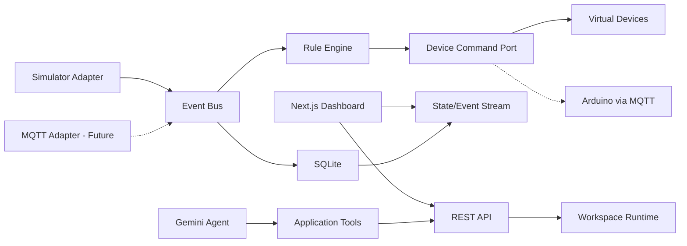

# AI Physical Workspace 구현 계획서

## 1. 문서 목적

이 문서는 기존 **Semantic Layer Explorer**를 **AI Physical Workspace**로 개선·확장하기 위한 실행 계획이다.

목표는 현재 구현된 `Ontology → REST API → Gemini → UI` 흐름을 보존하면서 다음 흐름으로 확장하는 것이다.

```text
Sensor → Event → Rule Engine → Device
                     ↑
            Gemini Rule Compiler
```

초기 버전은 실제 Arduino/MQTT 대신 Simulator를 사용한다. 이후 동일한 Adapter 계약을 구현한 MQTT 모듈로 교체하면 Dashboard, Rule Engine, Gemini, Database를 변경하지 않고 실제 하드웨어를 연결할 수 있어야 한다.

## 2. 제품 목표

사용자가 다음과 같은 자연어를 입력한다.

> 온도가 30도를 넘으면 팬을 켜.

Gemini는 자연어를 검증 가능한 Rule 후보로 변환한다.

```json
{
  "name": "High temperature fan",
  "condition": {
    "sensorId": "temperature-01",
    "operator": "gt",
    "value": 30,
    "unit": "celsius"
  },
  "action": {
    "deviceId": "relay-fan-01",
    "command": "on"
  }
}
```

사용자가 Rule을 승인하면 Rule Engine이 센서 이벤트를 결정론적으로 평가하고 가상 Device를 작동시킨다. 실행 과정은 Event Timeline과 Tool Trace에서 확인할 수 있어야 한다.

## 3. 포트폴리오에서 보여줄 역량

- Semantic Layer와 Ontology
- IoT와 Physical AI 구조
- Event-driven Architecture
- Gemini Function Calling
- 자연어에서 구조화된 Rule로의 변환
- 결정론적 Rule Engine
- Adapter/Port 기반 하드웨어 추상화
- SQLite와 Drizzle ORM
- REST API와 실시간 Dashboard
- Docker, ALB, AWS private EC2 배포
- 안전한 물리 명령 경계와 감사 가능한 Event Log

## 4. 구현 범위

### 포함

- Sensor: 온도, 조도, 거리, 버튼
- Device: LED, Servo, Buzzer, Relay/Fan
- 시드 기반 Simulator와 수동 시나리오 실행
- Sensor Reading과 Device State 실시간 표시
- Rule 생성, 조회, 수정, 활성화, 비활성화, 삭제
- Rule 실행과 Event Timeline
- Ontology Explorer 확장
- Gemini 기반 Rule 제안과 현재 상태 질의
- SQLite 영속화
- AWS Docker 배포
- 향후 MQTT Adapter 계약과 topic 명세

### 제외

- 실제 Arduino 펌웨어
- 실제 MQTT Broker 운영
- 카메라와 영상 분석
- 음성 명령
- Raspberry Pi 및 ROS2
- MCP Server
- 복잡한 사용자 권한 관리
- 그래프 데이터베이스
- OWL, RDF, SPARQL, Reasoner

제외 항목은 README의 Future Work에서만 제시한다.

## 5. 확정된 환경 및 배포 결정

- 공개 주소: `https://ai-workspace.sampoongapt.com`
- Ingress: 기존 internet-facing ALB의 HTTPS 443 Listener
- Routing: `Host = ai-workspace.sampoongapt.com`
- Target Group: private EC2 `3010`
- Container: 내부 `3000`, 호스트 매핑 `3010:3000`
- Database: `/app/data/ai-workspace.sqlite`
- 초기 Adapter: `simulator`
- 향후 Adapter: `mqtt`
- Gemini SDK: `@google/genai`
- Gemini 모델: `gemini-3.5-flash-lite`
- Vertex AI location: `global`
- EC2 GCP 인증파일: `/home/ubuntu/gcp-key.json`
- Container 인증파일: `/app/gcp-key.json:ro`
- 실제 배포 환경파일: `.fordeploy/ai-workspace-aws/.env.production`

환경과 배포 준비에 대한 세부 결정은 `docs/physical-ai-environment-plan.md`를 따른다.

## 6. 목표 아키텍처



### 핵심 경계

1. Gemini는 SQLite와 Device Adapter에 직접 접근하지 않는다.
2. Gemini는 Tool Layer를 통해 Ontology, State, Event, Rule API만 사용한다.
3. Gemini는 Rule 후보를 제안하지만 Rule을 직접 실행하지 않는다.
4. Rule Engine은 LLM 없이 순수하고 결정론적인 코드로 동작한다.
5. Dashboard와 Rule Engine은 데이터 출처가 Simulator인지 MQTT인지 알지 못한다.
6. 모든 Sensor Reading, Rule Evaluation, Device Command, State Change는 Event로 기록한다.

## 7. 저장소 목표 구조

단일 저장소를 유지하되 역할별 모듈 경계를 명확히 한다.

```text
app/
  api/
    health/
    ontology/
    sensors/
    devices/
    state/
    events/
    rules/
    simulator/
    ai/
  dashboard/
  ontology/
  rules/
  ai/

components/
  shell/
  ontology/
  dashboard/
  rules/
  ai/

db/
  schema/
    ontology.ts
    workspace.ts
  migrations/
  client.ts

domain/
  sensor.ts
  device.ts
  event.ts
  rule.ts
  ontology.ts

runtime/
  event-bus.ts
  rule-engine.ts
  workspace-runtime.ts
  state-store.ts

adapters/
  physical-workspace-adapter.ts
  simulator/
    simulator-adapter.ts
    sensor-generators.ts
    scenarios.ts
    virtual-devices.ts
  mqtt/
    mqtt-adapter.ts
    topic-contract.ts

ai/
  client.ts
  prompt.ts
  tools.ts
  rule-compiler.ts

.fordeploy/
  ai-workspace-aws/
    Dockerfile
    deploy.sh
    .env.example
    .env.production
```

초기 리팩터링에서 모노레포로 전환하지 않는다. 실제 Gateway 또는 Arduino 코드가 추가되는 시점에 `apps/`, `services/`, `firmware/` 모노레포 전환을 재검토한다.

## 8. 공통 도메인 계약

### SensorReading

```ts
type SensorType = "temperature" | "light" | "distance" | "button";

type SensorReading = {
  eventId: string;
  sensorId: string;
  sensorType: SensorType;
  value: number | boolean;
  unit: "celsius" | "lux" | "centimeter" | "boolean";
  measuredAt: string;
  source: "simulator" | "mqtt";
};
```

### DeviceCommand

```ts
type DeviceType = "led" | "servo" | "buzzer" | "relay";

type DeviceCommand = {
  commandId: string;
  deviceId: string;
  deviceType: DeviceType;
  command: "on" | "off" | "set-angle" | "beep";
  value?: number;
  issuedBy: "rule-engine" | "user";
  issuedAt: string;
};
```

### Rule

문자열 표현식 대신 구조화된 operator를 사용한다.

```ts
type RuleDefinition = {
  id: string;
  name: string;
  description: string;
  condition: {
    sensorId: string;
    operator: "gt" | "gte" | "lt" | "lte" | "eq";
    value: number | boolean;
    unit: string;
  };
  action: {
    deviceId: string;
    command: "on" | "off" | "set-angle" | "beep";
    value?: number;
  };
  enabled: boolean;
  cooldownSeconds: number;
};
```

모든 계약은 TypeScript 타입과 Zod Schema를 함께 제공한다.

## 9. PhysicalWorkspaceAdapter

```ts
interface PhysicalWorkspaceAdapter {
  connect(): Promise<void>;
  disconnect(): Promise<void>;
  subscribeSensors(listener: (reading: SensorReading) => void): () => void;
  executeCommand(command: DeviceCommand): Promise<DeviceCommandResult>;
  getConnectionStatus(): ConnectionStatus;
}
```

`PHYSICAL_ADAPTER` 환경변수로 구현체를 선택한다.

```text
PHYSICAL_ADAPTER=simulator → SimulatorAdapter
PHYSICAL_ADAPTER=mqtt      → MqttAdapter
```

잘못된 Adapter 값은 조용히 simulator로 fallback하지 않고 애플리케이션 시작을 실패시킨다.

## 10. Simulator 설계

### Sensor 생성 방식

완전한 난수 대신 이전 값에 작은 변화량을 더하는 random walk를 사용한다.

- 온도: 20~35°C
- 조도: 20~1,000 lux
- 거리: 5~200 cm
- 버튼: 낮은 확률의 눌림 이벤트

`SIMULATOR_SEED`로 동일한 데이터 흐름을 재현할 수 있어야 한다.

### 데모 시나리오

- `normal`
- `high-temperature`
- `dark-room`
- `object-approaching`
- `button-pressed`
- `sensor-disconnected`

면접 중 난수 발생을 기다리지 않도록 특정 센서값 수동 주입 API와 Scenario 실행 버튼을 제공한다.

### Virtual Device

- LED: `on/off`
- Servo: `0~180°`
- Buzzer: `on/off` 또는 제한된 beep duration
- Relay/Fan: `on/off`

모든 실행은 성공 또는 실패 결과를 Event로 생성한다.

## 11. SQLite 데이터 모델

기존 Ontology 테이블은 의미 모델로 유지한다.

```text
classes
properties
individuals
relations
```

운영 데이터는 별도 테이블로 추가한다.

### sensors

- `id`
- `name`
- `type`
- `unit`
- `room_individual_id`
- `ontology_individual_id`
- `enabled`
- `created_at`

### devices

- `id`
- `name`
- `type`
- `room_individual_id`
- `ontology_individual_id`
- `state_json`
- `enabled`
- `updated_at`

### sensor_readings

- `id`
- `event_id`
- `sensor_id`
- `value_json`
- `measured_at`
- `source`

### rules

- `id`
- `name`
- `description`
- `condition_json`
- `action_json`
- `enabled`
- `cooldown_seconds`
- `last_triggered_at`
- `created_at`
- `updated_at`

### events

- `id`
- `event_id`
- `type`
- `source_type`
- `source_id`
- `payload_json`
- `occurred_at`

초기 포트폴리오 규모에서는 JSON column을 사용해 Rule/State payload를 단순하게 유지한다. API 경계에서 Zod로 검증한다.

### 인덱스

실제 조회 패턴에 맞춰 다음만 우선 생성한다.

- `sensor_readings(sensor_id, measured_at)`
- `events(occurred_at)`
- `events(type, occurred_at)`
- `rules(enabled)`

SQLite는 WAL mode와 busy timeout을 설정한다. DB 파일과 migration 결과는 `/app/data` volume에 유지한다.

## 12. Ontology 초기 데이터

### Classes

- Sensor
- TemperatureSensor
- LightSensor
- DistanceSensor
- ButtonSensor
- Device
- LED
- Servo
- Buzzer
- Relay
- Room
- Rule
- Event

### Properties

- `locatedIn`: Sensor/Device → Room
- `emits`: Sensor → Event
- `evaluatedBy`: Event → Rule
- `triggers`: Rule → Device
- `controls`: Rule → Device
- `hasState`: Device → Event

### Individuals

- TemperatureSensor01
- LightSensor01
- DistanceSensor01
- ButtonSensor01
- Led01
- Servo01
- Buzzer01
- FanRelay01
- DemoRoom

Ontology는 가능한 Entity와 관계의 의미를 설명한다. 현재 온도나 LED 상태 같은 변경 데이터는 operational table에 저장한다.

## 13. REST API 계획

### Semantic Layer

- `GET /api/ontology`
- `GET /api/classes`
- `GET /api/properties`
- `GET /api/individuals`
- `GET /api/relations`

기존 API의 응답 호환성을 우선 유지한다.

### Workspace

- `GET /api/state`
- `GET /api/sensors`
- `GET /api/devices`
- `POST /api/devices/:id/commands`
- `GET /api/events?limit=50`

### Rules

- `GET /api/rules`
- `POST /api/rules`
- `GET /api/rules/:id`
- `PATCH /api/rules/:id`
- `DELETE /api/rules/:id`
- `POST /api/rules/:id/enable`
- `POST /api/rules/:id/disable`

### Simulator

- `GET /api/simulator/status`
- `POST /api/simulator/start`
- `POST /api/simulator/stop`
- `POST /api/simulator/scenarios/:scenario`
- `POST /api/simulator/sensors/:id/readings`

Simulator API는 `PHYSICAL_ADAPTER=simulator`일 때만 활성화한다.

### AI

- `POST /api/ai/rules/propose`
- `POST /api/ai/chat`

### Operations

- `GET /api/health`
- `GET /api/ready`

ALB Health Check는 Gemini 호출 없이 DB와 애플리케이션 process만 확인해야 한다.

## 14. Rule Engine 계획

Rule Engine은 SensorReading을 입력받아 활성 Rule을 평가한다.

```text
SensorReading
→ enabled Rule 조회
→ sensorId 일치 확인
→ operator 평가
→ cooldown 확인
→ DeviceCommand 생성
→ Adapter 실행
→ RuleTriggered/DeviceStateChanged Event 저장
```

### 안전 규칙

- Sensor, operator, Device, command allowlist
- Servo angle `0~180`
- Buzzer duration 상한
- 동일 Rule cooldown
- command idempotency key
- 수동 Device override 기록
- Sensor disconnected 상태에서는 관련 Rule 중단
- 실패한 Device 명령을 성공으로 기록하지 않음
- 초기 버전에서는 Rule 하나당 condition 하나와 action 하나만 지원

복합 AND/OR 조건은 Future Work로 남긴다.

## 15. Gemini Agent 계획

### 역할 1: Rule Compiler

자연어를 `RuleDefinition` 후보로 변환한다.

```text
getOntology()
→ getSensors()
→ getDevices()
→ proposeRule()
→ Zod validation
→ 사용자 미리보기 및 승인
→ POST /api/rules
```

Gemini가 Rule 저장 도구를 직접 호출하지 않게 하고, 초기 버전에서는 사용자의 명시적 승인 후 애플리케이션이 저장한다.

### 역할 2: State Analyst

다음 질문을 지원한다.

- 현재 상태 알려줘.
- 최근에 팬이 왜 켜졌어?
- 어떤 Rule이 실행됐어?
- 조도가 가장 낮았던 시점은 언제야?

Tools:

- `getOntology`
- `getCurrentState`
- `getRecentEvents`
- `getRules`
- `getSensorReadings`

### 모델 및 인증

`sampoongaptcom`과 동일한 기준을 사용한다.

```text
GEMINI_MODEL=gemini-3.5-flash-lite
GOOGLE_CLOUD_LOCATION=global
GOOGLE_APPLICATION_CREDENTIALS=/app/gcp-key.json
```

현재 코드에 존재하는 `gemini-2.0-flash` fallback과 여러 모델 환경변수 우선순위는 제거한다.

## 16. UI 개선 및 재사용 계획

### 전역 Navigation

```text
Dashboard | Ontology | Rules | Ask AI
```

### Dashboard

- Runtime mode: SIMULATOR/MQTT badge
- Connection status
- Sensor cards
- Device state cards
- Scenario controls
- Event Timeline
- 최근 Rule 실행 결과

### Ontology

기존 Explorer의 다음 요소를 재사용한다.

- 좌측 Ontology Tree
- 중앙 Object Detail
- 우측 JSON Viewer
- React Flow Graph

고정된 Alice/Bob/OpenAI 위치와 타입은 제거하고 데이터 기반 노드 배치로 전환한다.

### Rules

- Rule 목록
- 활성화 상태
- 자연어 Rule 입력
- Gemini 생성 JSON 미리보기
- validation 결과
- 사용자 승인 버튼
- 수정/비활성화/삭제
- 최근 실행 시각

### Ask AI

기존 Ask AI 카드와 Tool Trace를 재사용한다.

- 현재 상태 질의
- Event 분석 결과
- 사용한 도구 목록
- 답변 근거가 된 Event 표시

### Event Timeline

```text
08:31:00 TemperatureSensor01 = 31.2°C
08:31:00 HighTemperatureRule matched
08:31:00 FanRelay01 command ON
08:31:01 FanRelay01 state ON
```

## 17. 실시간 업데이트 전략

초기 버전은 안정성과 구현 범위를 고려해 1~2초 polling으로 시작한다.

- Dashboard: `GET /api/state`
- Timeline: `GET /api/events?after=<cursor>`
- Rule 목록: 변경 시 revalidation

DB와 runtime이 안정된 후 SSE로 교체할 수 있다. WebSocket과 custom Next.js server는 실제 MQTT 또는 양방향 실시간 요구가 명확해질 때만 도입한다.

## 18. 기존 코드 전환 전략

### 보존

- Git history
- Semantic Layer 철학
- Ontology REST API
- React Flow
- Zod
- Drizzle
- Gemini tool-calling pattern
- UI palette와 panel system

### 교체 또는 리팩터링

- vinext/Sites runtime → 표준 Next.js standalone
- D1 client → file-backed SQLite client
- 단일 `app/explorer.tsx` → 역할별 components/routes
- 고정 demo graph → 데이터 기반 graph
- 기존 Gemini client → `sampoongaptcom` Vertex AI 패턴
- edge cache rate limit → AWS 환경에 맞는 server-side rate limit

### 마이그레이션 원칙

한 번에 전체를 교체하지 않는다. 각 단계에서 기존 Ontology UI와 API가 동작하는 상태를 유지한다.

## 19. 단계별 구현 계획

### Phase 0 — 기준선 고정

- 기존 API integration test 추가
- 기존 Ontology 응답 snapshot 고정
- 현재 UI smoke test 추가
- 전환 전 production build 성공 확인

완료 조건: 기존 기능의 회귀 여부를 자동으로 확인할 수 있다.

### Phase 1 — AWS 호환 Runtime 전환

- 표준 Next.js 16 scripts 복원
- standalone output 설정
- Cloudflare/Sites 전용 파일 제거 또는 보관 결정
- better-sqlite3와 Drizzle SQLite client 구성
- migration/seed 실행기 작성
- health/ready API 추가

완료 조건: 로컬 file SQLite에서 기존 Ontology API/UI가 동일하게 동작한다.

### Phase 2 — UI 컴포넌트 리팩터링

- `explorer.tsx` 분해
- 공통 App Shell과 Navigation 추가
- Ontology 페이지로 기존 기능 이동
- JSON Viewer, Tool Trace, Panel primitives 분리

완료 조건: 외형과 기존 동작을 보존하고 Dashboard/Rules 페이지를 추가할 자리가 생긴다.

### Phase 3 — Physical Domain과 Simulator

- 공통 Zod 계약 구현
- Sensor/Device/Event DB schema와 migration
- PhysicalWorkspaceAdapter 정의
- SimulatorAdapter 구현
- seed 기반 random walk
- scenario/manual injection
- Virtual Device 구현

완료 조건: Gemini 없이도 Simulator → Event → Virtual Device 상태 흐름을 확인할 수 있다.

### Phase 4 — Rule Engine

- Rule schema/table/repository
- operator evaluator
- cooldown/idempotency
- Event Bus 연결
- Device command 실행
- Rule CRUD API

완료 조건: 수동 생성 Rule이 Simulator 이벤트에 반응해 가상 Device를 작동시킨다.

### Phase 5 — Dashboard와 Timeline

- Sensor cards
- Device cards
- Simulator control
- Rule execution badge
- Event Timeline
- polling/cursor update
- responsive layout

완료 조건: 브라우저 하나에서 상태 변화와 Rule 실행을 실시간에 가깝게 확인한다.

### Phase 6 — Gemini Rule Compiler와 Chat

- Vertex AI client 통일
- ontology-first system prompt
- Tool Layer 확장
- Rule proposal endpoint
- JSON preview/approval UI
- state/event analysis chat
- 하루 요청 제한 재구현

완료 조건: 자연어 Rule 생성 데모와 현재 상태 질의 데모가 모두 성공한다.

### Phase 7 — Ontology 확장

- Physical AI class/property/individual seed
- operational entity 연결
- React Flow 자동 배치
- Sensor → Event → Rule → Device 관계 표시

완료 조건: Semantic Layer와 실제 runtime state가 어떻게 연결되는지 UI와 README에서 설명된다.

### Phase 8 — Docker와 AWS 배포

- production Dockerfile
- `.env.production` 이미지 포함 방식 적용
- EC2 GCP key read-only mount
- SQLite volume mount
- sampoongaptcom 방식의 Bastion → private EC2 배포 스크립트
- container/image cleanup 범위 격리
- ALB target group/health check 준비
- `ai-workspace.sampoongapt.com` 배포

완료 조건: 공개 URL에서 Simulator, Rule, Timeline, Ontology, Ask AI가 동작한다.

### Phase 9 — 포트폴리오 완성

- README 전면 개편
- Architecture와 Sequence Diagram
- Simulator와 실제 MQTT 전환 설명
- Demo Script
- Safety Boundaries
- Future Work
- screenshots/social preview

완료 조건: README만 읽어도 문제, 설계, AI 경계, 데모 방법, 향후 하드웨어 연결 방식을 이해할 수 있다.

## 20. 테스트 전략

### Unit

- operator evaluation
- Rule validation
- cooldown
- Simulator seed reproducibility
- Sensor generators
- Device command validation
- MQTT topic mapping contract

### Integration

- Sensor event → Rule match → Device command → Event 저장
- Rule mismatch 시 명령 미실행
- disabled Rule 미실행
- disconnected Sensor 처리
- Gemini proposal → Zod validation
- Ontology API regression

### API

- CRUD status/error cases
- invalid Device command
- invalid Rule
- pagination/cursor
- Simulator-only endpoint protection
- AI rate limiting

### UI

- Dashboard 렌더링
- Scenario 실행
- Rule 승인 흐름
- Timeline 갱신
- Ontology 선택/JSON/Graph
- 모바일 layout

### Deployment

- standalone build
- Docker health check
- volume persistence after restart
- GCP credential mount
- ALB health check
- container rollback

## 21. 관측성과 운영

구조화된 server log를 사용한다.

```text
eventId
sensorId
ruleId
commandId
deviceId
durationMs
result
```

Health endpoint는 다음 상태를 분리한다.

- process alive
- database ready
- adapter connected
- simulator running
- Gemini configured

Gemini 장애가 ALB health check 실패로 이어지지 않게 한다.

## 22. README 데모 시나리오

### 자연어 Rule

```text
"온도가 30도를 넘으면 팬을 켜."
→ Gemini Rule proposal
→ 사용자 승인
→ High Temperature scenario
→ Rule matched
→ Fan Relay ON
→ Timeline 기록
```

### 조도 Rule

```text
"방이 어두워지면 LED를 켜."
→ light < 100 lux
→ Dark Room scenario
→ LED ON
```

### AI 상태 분석

```text
"팬이 왜 켜졌어?"
→ getOntology
→ getCurrentState
→ getRecentEvents
→ HighTemperatureRule과 31.2°C Event를 근거로 설명
```

## 23. 주요 위험과 대응

| 위험 | 대응 |
| --- | --- |
| LLM이 잘못된 Device를 선택 | Ontology 조회, allowlist, Zod 검증, 사용자 승인 |
| 온도 경계에서 반복 실행 | cooldown과 이후 hysteresis 지원 |
| Simulator에 코드가 결합 | Adapter 계약과 공통 Event 사용 |
| SQLite lock | WAL, busy timeout, 짧은 transaction |
| 배포 후 DB 유실 | `/app/data` volume과 backup |
| 기존 sampoongapt 컨테이너 영향 | 독립 image/container/port/path 사용 |
| Gemini 모델 노후화 | `GEMINI_MODEL` 환경변수 단일화 |
| 인증파일 이미지 포함 | EC2 파일 read-only mount |
| 면접 중 조건 미발생 | 시나리오와 수동 센서값 주입 |

## 24. 최종 완료 정의

다음 조건을 모두 만족하면 Physical AI 1차 버전을 완료한 것으로 본다.

- Simulator가 4종 Sensor Reading을 지속적으로 생성한다.
- 4종 Virtual Device 상태를 Dashboard에서 확인할 수 있다.
- 자연어로 Rule 후보를 생성하고 승인·저장할 수 있다.
- Rule Engine이 LLM 없이 Rule을 평가한다.
- Rule 실행 결과가 Event Timeline에 기록된다.
- AI Chat이 상태와 Event를 근거로 답변한다.
- Ontology Graph가 Sensor → Event → Rule → Device 관계를 보여준다.
- Simulator와 MQTT가 동일한 Adapter 계약을 사용한다.
- 기존 Semantic Layer 핵심 API의 회귀 테스트가 통과한다.
- Docker 재시작 후 SQLite 데이터가 유지된다.
- `https://ai-workspace.sampoongapt.com`에서 전체 데모가 동작한다.
- README만으로 철학, 아키텍처, 안전 경계, 데모 흐름을 이해할 수 있다.

## 25. 첫 구현 단위

첫 번째 구현 작업은 **Phase 0과 Phase 1만** 수행한다.

1. 기존 Ontology API 회귀 테스트
2. 표준 Next.js standalone 전환
3. file-backed SQLite 전환
4. migration/seed 실행
5. health/ready endpoint
6. 기존 Explorer와 Ask AI 동작 보존

이 기준선이 안정된 후에만 Simulator와 Physical Domain 구현을 시작한다.
